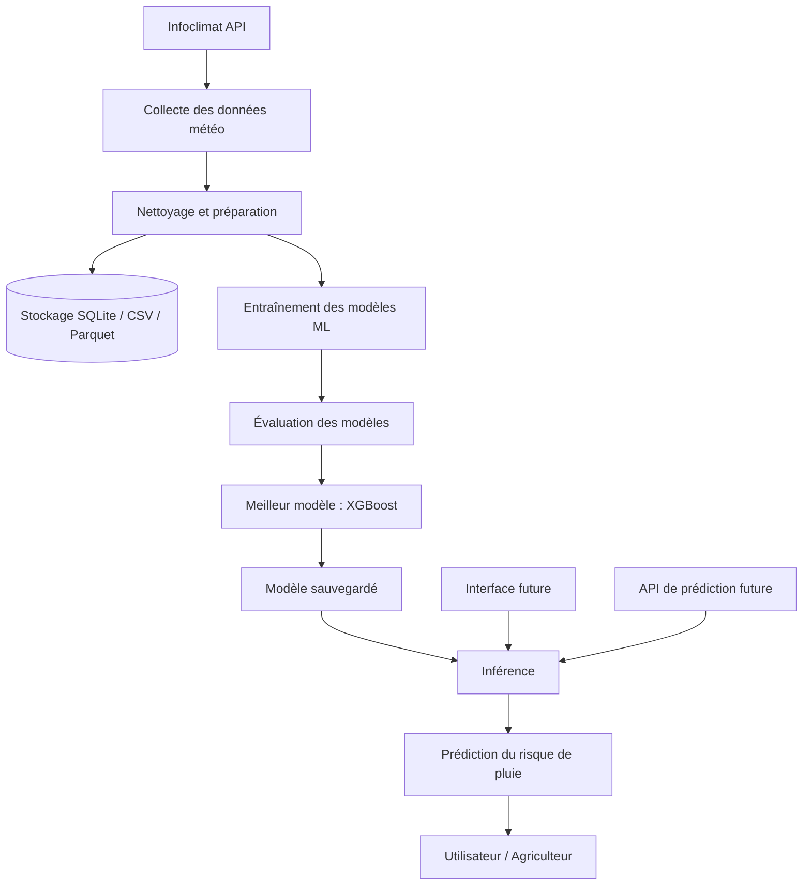

# GoutteEau
Ce dépôt est consacré au projet Goutte d'eau, développé dans le cadre de l'alternance professionnelle.

# Architecture

```mermaid
flowchart TD
    A[Infoclimat API] --> B[Collecte des données météo]
    B --> C[Nettoyage et préparation]
    C --> D[(Stockage SQLite / CSV / Parquet)]
    C --> E[Entraînement des modèles ML]
    E --> F[Évaluation des modèles]
    F --> G[Meilleur modèle : XGBoost]
    G --> H[Modèle sauvegardé]
    H --> I[Inférence]
    I --> J[Prédiction du risque de pluie]
    J --> K[Utilisateur / Agriculteur]

    L[Interface future] --> I
    M[API de prédiction future] --> I
```
